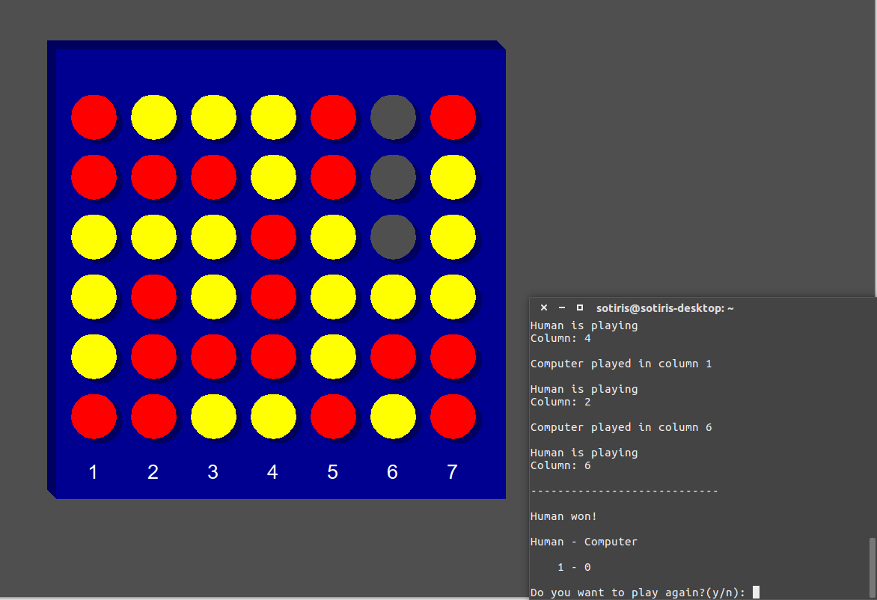

# Connect4py
A Connect 4 implementation for 1 or 2 players written in Python 2.7.
Requires the python-tk package.

This was created as a semester project in an introductory course to programming
in the Department of Electrical and Computer Engineering of the University of
Patras.

 

# Authors
Argiris Dramountanis

Nikos Kerastas

Vasilis Paloglou

Sotiris Papatheodorou

Stelios Tsiakalos
