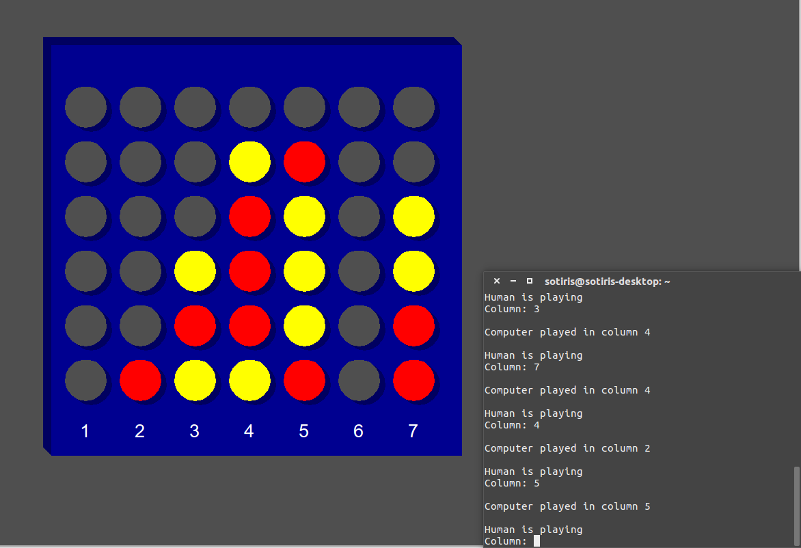
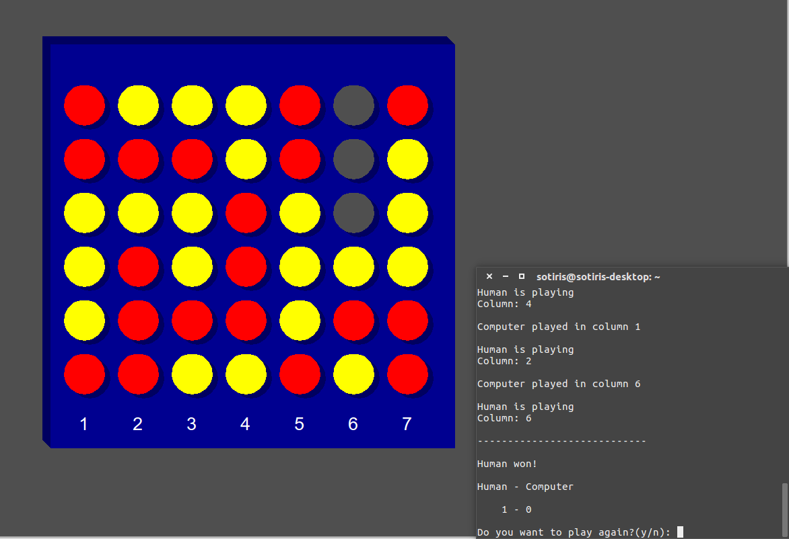

# Connect4py
A Connect 4 implementation for one or two players written in Python 2.7.
Requires the python-tk package.

This was created as a semester project in an introductory course to programming
in the Department of Electrical and Computer Engineering of the University of
Patras.

 

## Authors
Argiris Dramountanis

Nikos Kerastas

Vasilis Paloglou

Sotiris Papatheodorou

Stelios Tsiakalos

## License
This program is licensed under the GNU General Public License version 3.
